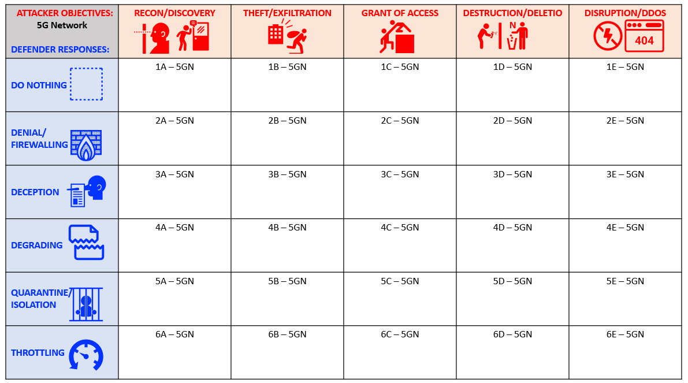

Daedalus
==========

A 5G core network can experience attacks from the radio (RAN) and the Data-Network side of the architecture. In most cases, the defense strategy for a 5G core-network is similar to that of securing an enterprise network. However, there are subtle differences between a 5G and an enterprise network that make the defenses different for each.

This project explores mechanisms to make informed decisions from a variety of response options that can be used to mitigate attack effectiveness by steering malicious actors to domains that the defender can better control for securing a 5G core-network. 
 
We have developed a set of attack classes and defense responses designed to achieve various outcomes in the way that the attacker exploits the network. These scenarios are listed in the matrix below.

We use the Red-Team/Blue-Team approach where the red-team serves as the attacker and the blue-team as the defender. The red-team has minimal knowledge of blue-team defenses as it develops an attack strategy. The blue-team is passive in the attack exercises, only recording what is needed to reproduce the scenario. The goal is not to necessarily develop new exploits, but rather to use known exploits, tools and techniques to navigate the attack surface.

